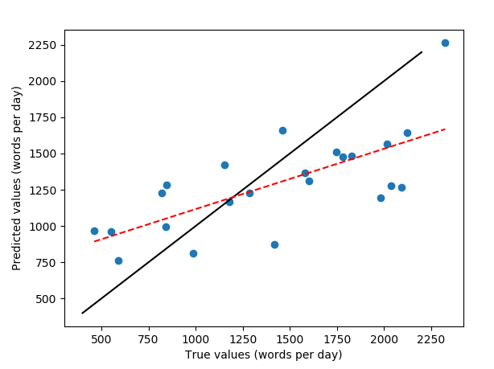
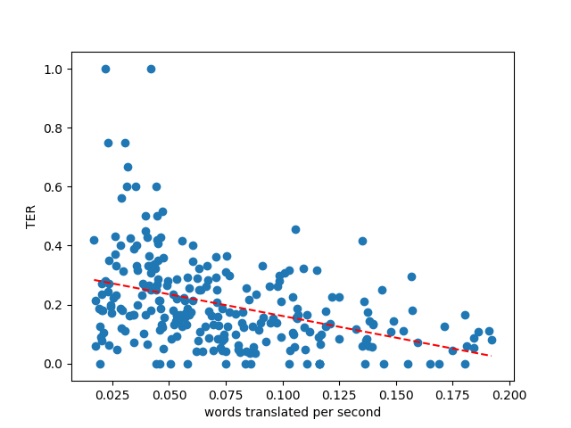

# un-trdiff
Exploration of the United Nations corpus and prediction of translation difficulty

## Things to cover

- Descriptive statistics of data
- Histograms + mean and medain values
- Correlation of sentence length and time taken to translate
- Show 2 or 3 easy and difficult sentence examples for en-fr and en-es
- Prediction experiments:
    + Biber - time per document
    + Biber - TER
    + XLM - TER
    + TER - time per sentence

## United Nations Corpus
    
**Figure 1.** Time it took to translate a document against the length of the document in words for a set of approximately 250 United Nations public documents.

    
**Figure 2.** Distribution of translation rate (words per day) for a set of approximately 250 United Nations public documents.

Biber dimensions (lexical, syntactic, text-level... features in texts) can be used to build regression models predicting the rate of translation of documents. A correlation of 0.65 can be obtained using linear regression (see figure 3). 

   
**Figure 3.** Rate of translation of documents. Predicted rate against reported rate. The solid black line shows the real values whilst the red dotted line shows an approximate line of best fit for the results obtained.

    
**Figure 4.** Distribution of translation edit rate for machine translated sentences with human reference for UN documents after removal of top and bottom 5% of TER scores. Original documents in English translated to Spanish (left) and French (right). 

    
**Figure 5.** Correlation of TER of machine translated sentences versus words translated per second for human translation of the same sentences.

### Time Taken - Sentence Length

The time taken to translate a sentence is dependent on the number of words it contains (see figure 6), however, there are still great differences between equal length sentences. There is a 0.65 correlation between time and sentence length for French translations and 0.70 for Spanish translations for the timed sentences (around 300 sentences). Note that the sentences used for Spanish translation are different to those used for French, therefore there will be some differences that are not entirely due to language properties. 

    
**Figure 6.** Time taken to translate a sentence against the number of words in the sentence.

     
**Figure 7.** Time taken to translate a sentence against the number of words in the sentence. The dotted red lines show the mean absolute error from the line of best fit. Sentences above the superior line could be considered difficult whilst those below the inferior line would be easy to translate.

## Prediction Experiments

### XLM - TER (sentence Level)

|Regression Algorithm*     | Correlation | MSE   |
|--------------------------|-------------|-------|
|Support Vector Regression | 0.27        | 0.029 |
|Linear Regression         | 0.42        | 0.026 |
|Adaboost (Decision Tree)  | 0.39        | 0.027 |
|Biber dimensions (not XLM)| 0.17        | 0.026 |

|Classification Algorithm*     | En-Es | En-Fr | 
|------------------------------|-------|-------|
|Support Vector Classification | 0.54  |  0.53 |
|MultiLayer Perceptron         | 0.54  |  0.51 |
|Adaboost (Decision Tree)      | 0.48  |  0.50 |
|Biber dimensions (not XLM)    | na    |  0.40 |

* Regression results on 200,000 English to French sentences.
* Accuracy on 3-class division (easy/average/difficult translation) using 200,000 sentences. 

See [results](results/) folder for complete scores. This includes other methods like stochastic gradient descent or naive-Bayes classification but these obtained similar results and are omitted for simplicity. The tables shown above also display the result of predicting TER using Biber dimensions instead of XLM embeddings. Linear regression and K-nearest neighbours are shown as these yielded the best results for Biber dimensions. 