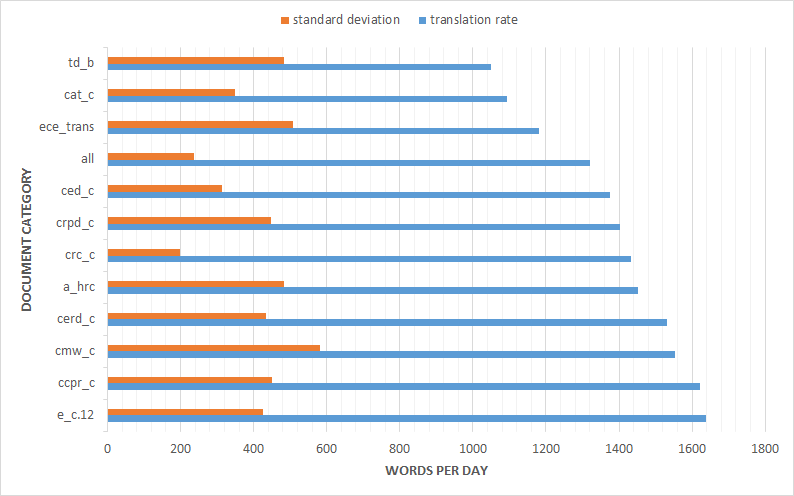

# un-trdiff
Exploration of the United Nations corpus and prediction of translation difficulty

## United Nations Corpus
    
**Figure 1.** Time it took to translate a document against the length of the document in words for a set of approximately 250 United Nations public documents.

    
**Figure 2.** Distribution of translation rate (words per day) for a set of approximately 250 United Nations public documents.