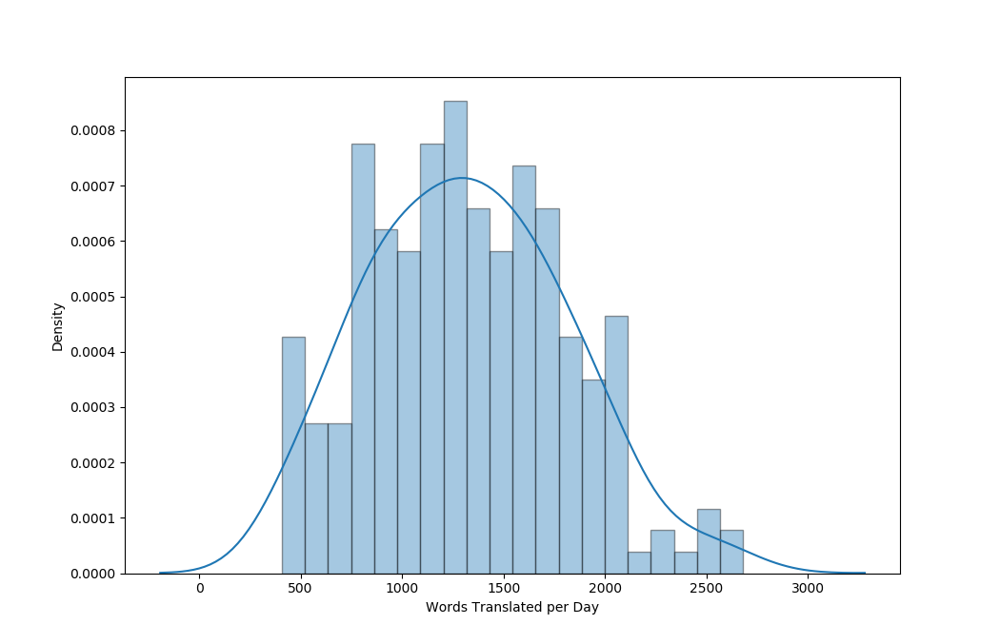
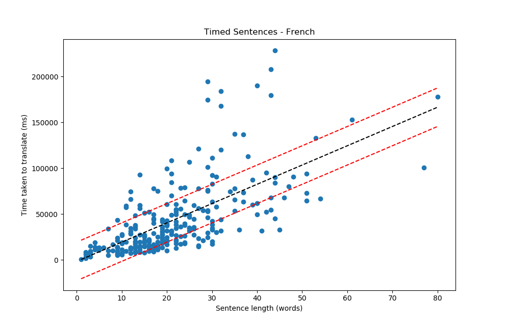

# un-trdiff
Exploration of the United Nations corpus and prediction of translation difficulty.    
See [trdiff](https://github.com/gcruzgar/trdiff) for more information as well as the scripts used to produce the insights shown below. The [case study](doc/trdiff-case_study.pdf) offers a one-page summary of the work conducted.
 
## United Nations Corpus
As one would expect, the time it takes to translate a document is roughly proportional to the number of words it contains (see figure 1). Nonetheless, there is great variance between documents. If time taken was only dependent on the length of a document, the rate of translation (words per day) would be a constant. In the case of the tested UN corpus this would be approximately 1429 words per day. However, as we can see in figure 2, there is a large distribution of translation rates across the documents (standard deviation of 484 words per day). Therefore, there must be other variables causing such differences. 

    
**Figure 1.** Time it took to translate a document against the length of the document in words for a set of approximately 250 United Nations public documents.

    
**Figure 2.** Distribution of translation rate (words per day) for a set of approximately 250 United Nations public documents.

Documents can be split into categories depending on things such as the topic of the text. In the case of the labeled UN corpus, documents can be split according to the department or committee that emitted the document. These categories may exhibit different behaviours and offer further insight into the varience in translation rate. An example of this is shown in figure 3, where the average translation rate of each category is displayed along with standard deviations.

    
**Figure 3.** Distribution of translation rate (words per day) for each category of documents in the timed United Nations corpus.

Biber dimensions (lexical, syntactic, text-level... features in texts) can be used to build regression models predicting the rate of translation of documents. A correlation of 0.65 can be obtained using linear regression (see figure 4). 

   
**Figure 4.** Rate of translation of documents predicted using Biber dimensions on a text level. Predicted rate against reported rate. The solid black line shows the real values whilst the red dotted lines show the mean absolute error from the line of best fit. Results obtained on cross-validated 12-fold split of the data.

    
**Figure 5.** Distribution of translation edit rate for machine translated sentences with human reference for UN documents after removal of top and bottom 5% of TER scores. Original documents in English translated to Spanish (left) and French (right). 

    
**Figure 6.** Correlation of TER of machine translated sentences versus words translated per mili-second for human translation of the same sentences.

For more information on the UN Parallel Corpus read the [paper](https://www.aclweb.org/anthology/L16-1561) by M. Ziemski et al.

### Time Taken - Sentence Length

The time taken to translate a sentence is dependent on the number of words it contains (see figure 7), however, there are still great differences between equal length sentences. There is a 0.65 correlation between time and sentence length for French translations and 0.70 for Spanish translations for the timed sentences (around 300 sentences). Note that the sentences used for Spanish translation are different to those used for French, therefore there will be some differences that are not entirely due to language properties. 

    
**Figure 7.** Time taken to translate a sentence against the number of words in the sentence.

     
**Figure 8.** Time taken to translate a sentence against the number of words in the sentence. The dotted red lines show the mean absolute error from the line of best fit. Sentences above the superior line could be considered difficult whilst those below the inferior line would be easy to translate.

## Prediction Experiments

### XLM - TER (sentence Level)

|Regression Algorithm*     | Correlation | MSE   |
|--------------------------|-------------|-------|
|Support Vector Regression | 0.27        | 0.029 |
|Linear Regression         | 0.42        | 0.026 |
|Adaboost (Decision Tree)  | 0.39        | 0.027 |
|Biber dimensions (not XLM)| 0.17        | 0.026 |

|Classification Algorithm*     | En-Es | En-Fr | 
|------------------------------|-------|-------|
|Support Vector Classification | 0.54  |  0.53 |
|MultiLayer Perceptron         | 0.54  |  0.51 |
|Adaboost (Decision Tree)      | 0.48  |  0.50 |
|Biber dimensions (not XLM)    | na    |  0.40 |

* Regression results on 200,000 English to French sentences.
* Accuracy on 3-class division (easy/average/difficult translation) using 200,000 sentences. 

See [results](results/) folder for complete scores. This includes other methods like stochastic gradient descent or naive-Bayes classification but these obtained similar results and are omitted for simplicity. The tables shown above also display the result of predicting TER using Biber dimensions instead of XLM embeddings. Linear regression and K-nearest neighbours are shown as these yielded the best results for Biber dimensions. 